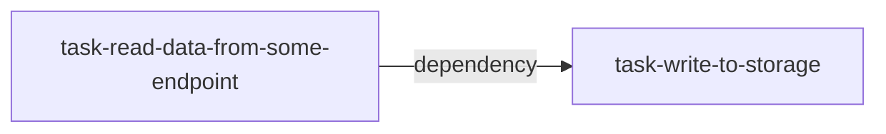

[](https://airflow.apache.org/)

## Contents
- [Introduction](#Introduction)
- [Airflow Architecture](#airflow-architecture)
- [Installing Airflow](#installing-airflow)
- [Fundamentals of Airflow](#fundamentals-of-airflow)
  - [Scheduler](#scheduler)
  - [Executors](#executors)
  - [hooks](#hooks)
- [Trigger Rule](#trigger-rule)
- [Testing](#testing)
     
---
## Introduction
[Airflow](https://airflow.apache.org/) is a batch-oriented framework for creating data pipelines.

It uses [DAG](https://en.wikipedia.org/wiki/Directed_acyclic_graph) to create data processing networks or pipelines.

- DAG stands for -> Direct Acyclic Graph. It flows in one direction. You can't come back to the same point, i.e. acyclic.

- In many data processing environments, a series of computations are run on the data to prepare it for one or more ultimate destinations. This type of data processing flow is often referred to as a data pipeline.
A DAG or data processing flow can have multiple paths, also called branching.

The simplest DAG could be like this.



where 
- `read-data-from-some-endpoint` & `write-to-storage`  - represent a task (unit of work)
- Arrow `-->` represents processing direction and dependencies to check on what basis the next action will be triggered.

### **Ok, so why should we use Airflow?**
- If you like *`Everything As Code`* and **everything** means everything, including your configurations 
. This helps to create any complex level pipeline to solve the problem.
- If you like open source because almost everything you can get as an inbuilt operator or executors.
- `Backfilling` features. It enables you to reprocess historical data.

### **And, why shouldn't you use Airflow?**
- If you want to build a streaming data pipeline. 

---
## Airflow Architecture

So, we have at least an idea that Airflow is created to build the data pipelines. Below we can see the different components of Airflow and their internal connections.


We can see the above components when we install Airflow, and implicitly Airflow installs them to facilitate the execution of pipelines. 
These components are 

- `DAG directory`, to keep all dag in place to be read by scheduler and executor.
- `Scheduler` parses DAGS, checks their schedule interval and starts scheduling DAGs tasks for execution by passing them to airflow workers.
- `Workers`, responsible for doing actual work. It picks up tasks and executes them.
- `Web server` presents a handy user interface to inspect, trigger, and debug the behaviour of DAGs and tasks.
- `Metadata Database`, used by the scheduler, executor, and webserver to store state so that all of them can communicate and take decisions.
        - follow this link to see, how to set and get metadata variables. [Accessing Metadata Database](#accessing-metadata-database)

For now, this is enough architecture. Let's move to the next part.

---
## Installing Airflow

---

## Fundamentals of Airflow 

We have installed Airflow and know at a high level what it stands for, 
but we have yet to discover how to build our pipeline. 

We will roughly touch on a few more concepts and create a full-fledged project using these concepts.

So, let's refresh our memory one more time. Airflow works on **`DAG`** principle, and DAG is an acyclic graph. 
We saw this example `read-data-from-some-endpoint --> write-to-storage` 

So, create an airflow DAG; we will write it like this

- Step 1

Create a DAG. It accepts a unique name, when to start it, and what could be the interval of running. There are many more parameters that it agrees to, but let's stick with these three.

```python
dag = DAG(                                                     
   dag_id="my_first_dag",                          
   start_date=airflow.utils.dates.days_ago(2),                
   schedule_interval=None,                                     
)
```
- Step 2
 
 And now, we need to create our two functions (I'm creating dummy functions) and will attach them to the Operator.
```python

def read_data_from_some_endpoint():
    pass

def write_to_storage():
    pass
 
```

- Step 3

Let's create our operators. We have python functions which need to be attached to some Operators. The last argument is that it accepts a DAG. Here we need to tell the operator which dag it will consider.

```python

download_data = PythonOperator(. # This is our Airflow Operator.
    task_id="download_data", # unique name; it could be any name 
    python_callable=read_data_from_some_endpoint, # python function/callable
    dag = dag # Here we will attach our operator with the dag which we created at 1st step.
) 

persist_to_storage = PythonOperator(
    task_id = "persist_to_storage",  
    python_callable = write_to_storage,
    dag = dag
) 
 ```

- Step 4

Now, Lets create the execution order of our operators

```python

download_data >> persist_to_storage  # >> is bit shift operator in python which is overwritten in Airflow to indicate direction of task flow.

 ```
That's it. We have successfully created our first DAG.


### **How bit shift operator (>> or <<) defines task dependency?**
The __ rshift __ and __ lshift __ methods of the BaseOperator class implements the Python bit shift logical operator in the context of setting a task or a DAG downstream of another.
See the implementation [here](https://github.com/apache/airflow/blob/5355909b5f4ef0366e38f21141db5c95baf443ad/airflow/models.py#L2569).

So, **`bit shift`** has been used as syntactic sugar for  `set_upstream` (<<) and `set_downstream` (>>) tasks.

For example 
`task1 >> task2` is same as `task2 << task1` is same as `task1.set_downstream(task2)` is same as  `task1.set_upstream(task2)`

This operator plays important role to build relationships among the tasks.


-----

## Airflow Module Structure

Airflow has a standard module structure. It has all its [important packages](https://airflow.apache.org/docs/apache-airflow/2.0.0/_modules/index.html) under airflow. Few of the essential module structures are here

- `airflow` - For DAG and other base API.
- `airflow.executors` : For all inbuilt executors.
- `airflow.operators` : For all inbuilt operators.
- `airflow.models` : For DAG, log error, pool, xcom (cross-communication) etc.
- `airflow.sensors` : Different sensors (in simple words, it is either time interval or file watcher to meet some criteria for task executions)
- `airflow.hooks` : Provides different modules to connect external API services or databases.


So, by looking at the above module, we can quickly determine that to get `PythonOperator` or any other Operator, we need to import 
them from `airflow.operators`. Similarly, an `executor` can be imported from `airflow.executors` and so on.

Apart from that, many different packages providers, including vendors and third-party enhance the capability of Airflow. All providers follow `apache-airflow-providers` nomenclatures for the package build.
Providers can contain operators, hooks, sensors, and transfer operators to communicate with many external systems, but they can also extend Airflow core with new capabilities.

This is the list of providers - [providers list](https://airflow.apache.org/docs/#providers-packages-docs-apache-airflow-providers-index-html)

-----
# Workloads

## **`Operators`**
Operators help run your function or any executable program.

Primarily there are three types of Operators.

**`(i) Operators`**

Helps to trigger certain action. Few of them are
- `PythonOperator` - To wrap a python callables/functions inside it.
- `BashOperator` - To call your bash script or command. Within BashOperator we can also call any executable program. 
- `DummyOperator` - To show a dummy task
- `DockerOperator` - To write and execute docker images.
- `EmailOperator` - To send an email (using SMTP configuration)
- `SSHOperator` - To execute commands on given remote host

*and there many more operators do exits.* See the full [operators list](https://airflow.apache.org/docs/apache-airflow/stable/_api/airflow/operators/index.html) in the official documentation.

**`(ii) Sensors`**

A particular type of operator whose purpose is to wait for an event to start the execution.
For instance, 
    
- `ExternalTaskSensor` waits on another task (in a different DAG) to complete execution.
- `S3KeySensor` S3 Key sensors are used to wait for a specific file or directory to be available on an S3 bucket.
- `NamedHivePartitionSensor` - Waits for a set of partitions to appear in Hive. 

**`(iii) Transfers`**

Moves data from one location to another. e.g.

- `MySqlToHiveTransfer` Moves data from MySql to Hive.
- `S3ToRedshiftTransfer` load files from s3 to Redshift.

## **`Scheduler`**

The scheduler is the crucial component of Airflow, as most of the magic happens here. It determines when and how your pipelines are executed. At a high level, the scheduler runs through the following steps.

1. Once users have written their workflows as DAGs, the scheduler reads the files containing these DAGs to extract the corresponding tasks, dependencies, and schedule intervals of each DAG.

2. For each DAG, the scheduler then checks whether the scheduled interval for the DAG has passed since the last time, it was read. If so, the tasks in the DAG are scheduled for execution.

3. For each scheduled task, the scheduler then checks whether the task's dependencies (= upstream tasks) have been completed. If so, the task is added to the execution queue.

4. The scheduler waits several moments before starting a new loop by jumping back to step 1.

👉 To start a scheduler, just run the `airflow scheduler` command. 

In Airflow, while defining the DAG, we provide a few options to let the scheduler know when jobs are required to be triggered.

`start_date` -> when to start the DAG.

`end_date` -> whne to stop the DAG

`schedule_interval` -> Time interval for the subsequent run. hourly, daily, minutes etc

`depends_on_past` -> Boolean to decide from when DAG will execute.

`retry_delay` -> time duration for next retry. It accepts `datetime` object. e.g. for 2 mins we will write timedelta(minutes=2)

Airflow scheduler works on the principle of **`Cron based job`** execution. Below is the cron presentation.

```
┌─────── minute (0 - 59)
│ ┌────── hour (0 - 23)
│ │ ┌───── day of the month (1 - 31)
│ │ │ ┌───── month (1 - 12)
│ │ │ │ ┌──── day of the week (0 - 6) (Sunday to Saturday;
│ │ │ │ │      7 is also Sunday on some systems)
* * * * *

```
**every 5th minute** -> */5 * * * *

**every hour at minute 30** e.g. at 10:30, 11:30, 12:30 and so on. -> 0,5,10 * * * * 

Sometimes if you haven't worked before on Unix based cron job scheduler, then it is tough to know how to write them exactly
(it's also tricky for experienced developers as well).

Check this website to generate cron expression - https://www.freeformatter.com/cron-expression-generator-quartz.html


## **`Executors`**

It helps to run the task instance (task instances are functions which we have wrapped under operator)


### `Types of Executors`

There are two types of executors

**`Local Executors`**

- [Debug Executor](https://airflow.apache.org/docs/apache-airflow/stable/executor/debug.html)- The DebugExecutor is a debug tool and can be used from IDE. It is a single process executor that queues tasks and executes them.
- [Sequential Executor](https://airflow.apache.org/docs/apache-airflow/stable/executor/sequential.html) - Default executor and runs within scheduler. Apart from this, it executes one task instance at a time, which eventually makes it not a good candidate for production.
- [Local Executor](https://airflow.apache.org/docs/apache-airflow/stable/executor/local.html) - Run within scheduler and execute multiple tasks instance at a time. Again not a good candidate for production as it doesn't scale.

**`Remote Executors`**

- [Celery Executor](https://airflow.apache.org/docs/apache-airflow/stable/executor/celery.html) - Run tasks on dedicated machines(workers). It uses distributed task queue to distribute loads to different workers to parallelise work. It horizontally scales, making it fault-tolerant and a good candidate for production.
- [Kubernetes Executor](https://airflow.apache.org/docs/apache-airflow/stable/executor/kubernetes.html) - Run tasks in dedicated POD(worker), and Kubernetes APIs get used to managing the POD. It scales efficiently and is a perfect candidate for production.
    - [LocalKubernetes Executor](https://airflow.apache.org/docs/apache-airflow/stable/executor/local_kubernetes.html) - Local kubernetes executor.
- [CeleryKubernetes Executor](https://airflow.apache.org/docs/apache-airflow/stable/executor/celery_kubernetes.html) - It allows users to run a CeleryExecutor and a KubernetesExecutor simultaneously. An executor is chosen to run a task based on the task's queue. Choice of this executor is only needed in [a few cases](https://airflow.apache.org/docs/apache-airflow/stable/executor/celery_kubernetes.html).
- [Dask Executor](https://airflow.apache.org/docs/apache-airflow/stable/executor/dask.html) -Dask clusters can be run on a single machine or remote networks.

## **`Hooks`**

A high-level interface to establish a connection with databases or other external services.

[List of different available hooks](https://airflow.apache.org/docs/apache-airflow/stable/_api/airflow/hooks/index.html?highlight=hooks#module-airflow.hooks)

## *What if something I'm interested in is not present in any of the modules?*

You didn't find the right operator, executors, sensors or hooks? No worries, you can write your custom stuff.
Airflow provides Base classes which we can inherit to write our custom classes.

```python
from airflow.models import BaseOperator
from airflow.sensors.base import BaseSensorOperator
from airflow.hooks.base_hook import BaseHook
from airflow.utils.decorators import apply_defaults

class MyCustomOperator(BaseOperator):
    
    @apply_defaults # for default parameters from DAG
    def __init__(**kwargs):
        super(MyCustomOperator).__init__(**kwargs)
        pass
    def execute(self, conext): # we will cover more about context in next part.
        #your logic
        pass


class MyCustomSensor(BaseSensorOperator):
    
    @apply_defaults # for default parameters from DAG
    def __init__(**kwargs):
        super(MyCustomSensor).__init__(**kwargs)
        pass
    def poke(self, context): 
        #your logic
        pass

class MyCustomHook(BaseHook):
    
    @apply_defaults # for default parameters from DAG
    def __init__(**kwargs):
        super(MyCustomHook).__init__(**kwargs)
        pass
    def get_connection(self):
        #your logic
        pass

```

## Trigger Rule

All Airflow operators provides `trigger_rule` argument the defines as
**trigger this task when all directly upstream tasks have succeeded**
 
- All existing options are
    - all_success: (default) all parents have succeeded
    - all_failed: all parents are in a failed or upstream_failed state
    - all_done: all parents are done with their execution
    - one_failed: fires as soon as at least one parent has failed, it does not wait for all parents to be done
    - one_success: fires as soon as at least one parent succeeds, it does not wait for all parents to be done
    - none_failed: all parents have not failed (failed or upstream_failed) i.e. all parents have succeeded or been skipped
    - none_skipped: no parent is in a skipped state, i.e. all parents are in a success, failed, or upstream_failed state
    - dummy: dependencies are just for show, trigger at will


# Testing

For Airflow, generally below tests can be performed.

- **DAG Validation Test** 
        - To test whether DAG is Valid and Acyclic.
- **Unit Test** 
        - To test python functions, operators etc.

- **Integration Test** 
        - To test whether tasks of the workflow can connect each other.

- **Workflow Test** 
        - To test complete pipeline

Check these blogs for in depth knowledge.

- [medium-blog](https://medium.com/wbaa/datas-inferno-7-circles-of-data-testing-hell-with-airflow-cef4adff58d8)
- [airflow-testing-example](https://www.astronomer.io/guides/testing-airflow)